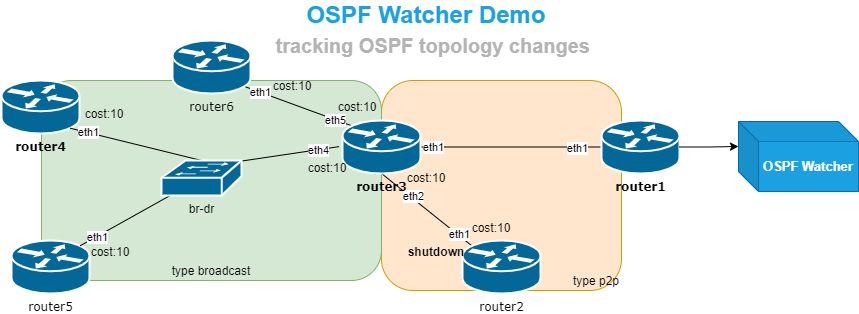

# OSPF watcher. Tracking OSPF topology changes in Real-Time




## Quickstart

1. [Install](https://containerlab.srlinux.dev/install/) containerlab.
2. Run the script to prepare environment:

    ```
    ./prepare.sh
    ```

3. Start the lab
    ```
    sudo clab deploy --topo frr01.clab.yml
    ```

4. Start watching logs
    ```
    sudo tail -f watcher/watcher.log
    ```

5. Change OSPF settings on lab' routers. Connect to a router
    ```
    sudo docker exec -it clab-frr01-router2 vtysh
    ```

### OSPF Watcher logs location
Available under `watcher` folder. To see them:
```
sudo tail -f watcher/watcher.log
```

### OSPF Watcher logs
```
router4(config-if)# shutdown
2024-07-22T20:20:04Z,watcher-local,host,10.10.10.4,down,10.10.10.5,,
2024-07-22T20:20:04Z,watcher-local,metric,10.10.10.4,changed,old_cost:10,new_cost:-1,10.10.10.5,,

router4(config-if)# no shutdown
2024-07-22T21:54:49Z,watcher-local,host,10.10.10.4,up,10.10.10.5,,
2024-07-22T21:54:59Z,watcher-local,host,10.10.10.5,up,10.10.10.4,,
2024-07-22T21:54:59Z,watcher-local,metric,10.10.10.5,changed,old_cost:-1,new_cost:10,10.10.10.4,,

router4(config-if)# ip ospf cost 4444
2024-07-22T20:19:05Z,watcher-local,metric,10.10.10.5,changed,old_cost:10,new_cost:4444,10.10.10.4,,

router5(config)# ip route 8.8.0.64/30 Null0
2024-07-22T20:24:08Z,watcher-local,network,8.8.0.60/30,changed,old_cost:-1,new_cost:12,10.10.10.5,,,external,1
2024-07-22T20:24:08Z,watcher-local,network,8.8.0.60/30,up,10.10.10.5,,

router4(config-router)# redistribute static metric 444 metric-type 2
2024-07-22T21:04:23Z,watcher-local,network,4.4.4.10/32,changed,old_cost:-1,new_cost:444,10.10.10.4,,,external,2
2024-07-22T21:04:23Z,watcher-local,network,4.4.4.10/32,up,10.10.10.4,,

router2(config-if)# shutdown
2024-07-20T13:42:43Z,watcher-local,host,10.10.10.2,down,10.10.10.3,,
2024-07-22T20:28:06Z,watcher-local,metric,10.10.10.2,changed,old_cost:10,new_cost:-1,10.10.10.3,,
2024-07-22T20:28:06Z,watcher-local,network,192.168.23.0/24,down,10.10.10.3,,
2024-07-22T20:28:06Z,watcher-local,network,192.168.23.0/24,changed,old_cost:10,new_cost:-1,10.10.10.3,,,internal,0

router2(config-if)# no shutdown
2024-07-22T20:29:33Z,watcher-local,network,192.168.23.0/24,up,10.10.10.3,,
2024-07-22T20:29:33Z,watcher-local,network,192.168.23.0/24,changed,old_cost:-1,new_cost:10,10.10.10.3,,,internal,0
2024-07-22T20:29:43Z,watcher-local,host,10.10.10.2,up,10.10.10.3,,
2024-07-22T20:29:43Z,watcher-local,metric,10.10.10.2,changed,old_cost:-1,new_cost:10,10.10.10.3,,
2024-07-22T20:29:53Z,watcher-local,host,10.10.10.3,up,10.10.10.2,,
2024-07-22T20:29:53Z,watcher-local,metric,10.10.10.3,changed,old_cost:-1,new_cost:10,10.10.10.2,,

router2(config-if)# ip ospf cost 222
2024-07-22T21:55:32Z,watcher-local,metric,10.10.10.3,changed,old_cost:10,new_cost:222,10.10.10.2,,
2024-07-22T21:55:32Z,watcher-local,network,192.168.23.0/24,changed,old_cost:10,new_cost:222,10.10.10.2,,,internal,0
```

##### Logs sample 1  
```
2023-01-01T00:00:00Z,demo-watcher,host10.10.10.4,down,10.10.10.5,01Jan2023_00h00m00s_7_hosts
```

* `2023-01-01T00:00:00Z` - event timestamp
* `demo-watcher` - name of watcher
* `host` - event name: `host`, `network`, `metric`
* `10.10.10.4` - event object. Watcher detected an event related to `10.10.10.4` host
* `down` - event status: `down`, `up`, `changed`
* `10.10.10.5` - event detected by this node.
* `01Jan2023_00h00m00s_7_hosts` - name of graph in Topolograph dashboard
*Summary: `10.10.10.5` detected that `10.10.10.4` host went down at `2023-01-01T00:00:00Z`*

##### Logs sample 2  
```
2023-01-01T00:00:00Z,demo-watcher,network,192.168.13.0/24,changed,old_cost:10,new_cost:12,10.10.10.1,01Jan2023_00h00m00s_7_hosts,0.0.0.0,1234,internal,0
```

* `2023-01-01T00:00:00Z` - event timestamp
* `demo-watcher` - name of watcher
* `metric` - event name: `host`, `network`, `metric`
* `192.168.13.0/24` - event object. Watcher detected an event related to `192.168.13.0/24` subnet
* `changed` - event status: `down`, `up`, `changed`
* `10` - old cost
* `12` - new cost
* `10.10.10.1` - event detected by this node.
* `01Jan2023_00h00m00s_7_hosts` - name of graph in Topolograph dashboard
* `0.0.0.0` - OSPF area ID
* `1234` - AS number where OSPF is working
* `internal` - type of network: `internal` or `external`
* `0` - subtype of network: type-1, type-2 or 0 for internal subnets
*Summary: `10.10.10.1` detected that metric of `192.168.13.0/24` internal stub network changed from `10` to `12` at `2023-01-01T00:00:00Z` in area 0*


Note:
log file should have `systemd-network:systemd-journal` ownership
