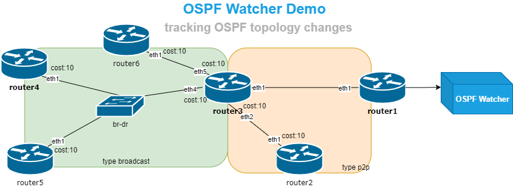

# OSPF watcher. Tracking OSPF topology changes in Real-Time


This lab consists of 6 FRR routers and a single OSPF Watcher. Each router is pre-configured to be part of an OSPF domain with different network types. Any topology changes detected by the OSPF Watcher are logged in the file `watcher/watcher.log`. The logging capabilities can be enhanced with tools like ELK or Topolograph, enabling features such as searching changes by time and exporting data to message brokers, Zabbix, and more. For further details, refer to the Links page.

### OSPF Topology Watcher
OSPF Watcher is a monitoring tool of OSPF topology changes for network engineers. It works via passively listening to OSPF control plane messages through a specially established OSPF adjacency between OSPF Watcher and one of the network device. *It assists in analyzing incidents by determining the precise time and location of events, as well as their distribution across the network in a retrospective manner.*  

#### Detected network events:
* OSPF neighbor adjacency Up/Down
* OSPF link cost changes
* OSPF networks appearance/disappearance from the topology

## Quickstart

1. [Install](https://containerlab.srlinux.dev/install/) containerlab.
2. Run the script to prepare environment:

    ```
    sudo ./prepare.sh
    ```

3. Start the lab
    ```
    sudo clab deploy --topo ospf01.clab.yml
    ```

4. Check that Watcher is ready (usually it requires 10-15sec to be ready). Proceed to the next step once Watcher is ready.  
    ```
    sudo docker logs clab-ospf01-ospf-watcher
    ```
    Expected output:
    ```
    lsdb_output:
    OSPF Instance: 1


        OSPF Router with ID (10.10.10.1)


                    Router Link States (Area 0.0.0.0)

    LS age: 9
    Options: 0x2  : *|-|-|-|-|-|E|-
    LS Flags: 0x3
    Flags: 0x0
    LS Type:
    OSPF LSDB has been received
    Sniffing packets on interface: eth1
    ```

5. Start watching logs
    ```
    sudo tail -f watcher/logs/watcher1.ospf.log
    ```

6. Change OSPF settings on lab' routers. Connect to a router
    ```
    sudo docker exec -it clab-ospf01-router6 vtysh
    ```
    Change metric on the interface
    ```
    router6# conf t
    router6(config)# int eth1
    router6(config-if)# ip ospf cost 66
    ```

    Add new stub network
    ```
    router6(config-if)# ip address 10.10.36.6/24
    ```

    Remove external type-2 subnet
    ```
    router6(config-if)# exit
    router6(config)# no ip route 6.6.6.6/32 192.168.36.3
    ```

    Shutdown adjancency
    ```
    router6(config)# int eth1
    router6(config-if)# shutdown
    ```

### OSPF Watcher logs location
Available under `watcher` folder. To see them:
```
sudo tail -f watcher/watcher.log
```


##### Logs sample 1  
```
2023-01-01T00:00:00Z,demo-watcher,host10.10.10.4,down,10.10.10.5,01Jan2023_00h00m00s_7_hosts,0,1234,192.168.145.5
```

* `2023-01-01T00:00:00Z` - event timestamp
* `demo-watcher` - name of watcher
* `host` - event name: `host`, `network`, `metric`
* `10.10.10.4` - event object. Watcher detected an event related to `10.10.10.4` host
* `down` - event status: `down`, `up`, `changed`
* `10.10.10.5` - event detected by this node.
* `01Jan2023_00h00m00s_7_hosts` - name of graph in Topolograph dashboard
* `0.0.0.0` - OSPF area ID
* `1234` - AS number where OSPF is working
* `192.168.145.5` - IP address on detected node
*Summary: `10.10.10.5` detected that `10.10.10.4` host on the interface with `192.168.145.5` IP address in area 0 in AS 1234 went down at `2023-01-01T00:00:00Z`*

##### Logs sample 2  
```
2023-01-01T00:00:00Z,demo-watcher,network,192.168.13.0/24,changed,old_cost:10,new_cost:12,10.10.10.1,01Jan2023_00h00m00s_7_hosts,0.0.0.0,1234,internal,0
```

* `2023-01-01T00:00:00Z` - event timestamp
* `demo-watcher` - name of watcher
* `metric` - event name: `host`, `network`, `metric`
* `192.168.13.0/24` - event object. Watcher detected an event related to `192.168.13.0/24` subnet
* `changed` - event status: `down`, `up`, `changed`
* `10` - old cost
* `12` - new cost
* `10.10.10.1` - event detected by this node.
* `01Jan2023_00h00m00s_7_hosts` - name of graph in Topolograph dashboard
* `0.0.0.0` - OSPF area ID
* `1234` - AS number where OSPF is working
* `internal` - type of network: `internal` or `external`
* `0` - subtype of network: type-1, type-2 or 0 for internal subnets
*Summary: `10.10.10.1` detected that metric of `192.168.13.0/24` internal stub network changed from `10` to `12` at `2023-01-01T00:00:00Z` in area 0*


Note:
log file should have `systemd-network:systemd-journal` ownership
